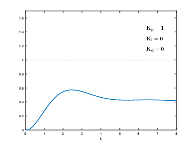

# Introduction to PID

$$
PID=P+I+d
$$

## PID控制器的含义

PID控制器（比例-积分-微分控制器），由由比例单元、积分单元、微分单元组成。可以通过调整这三个单元的增益来调整其特性。PID控制器根据输入的数据和参考值来计算误差，同时根据历史数据来调整新的输入值，目的是为了使系统达到或保持在参考值。

PID可以减少控制参数，从而变成PI、PD、P、I控制器。

图1.PID控制器的控制回路方块图

## 理论

PID算法可以用下式表示：

$$
u(t)=K_pe(t)+K_i\int_0^te(\tau)d\tau+K_d\frac{d}{dt}e(t)
$$

其中：

$K$：为比例增益（调适参数）

$e$：误差 = 设定值 - 回授值

$t$：目前时间

$\tau$：积分变量

传递方程 $Y(s)=H(s)X(s)$ 中的传递函数为：

$$
H(s)=\frac{K_ds^2+K_ps+K_i}{s+C}
$$

## 控件分析

### 比例单元（；）

比例控制考虑当前误差，误差值和一个正值的常数$K_p$（表示比例）相乘

例如对于一个热水壶的控制，可以用如下式子来表示：

$$
P_{out}=K_Pe(t)
$$

其中：$e(t)$为目前温度与目标温度的差值（正值），控制效果曲线如下

### 积分单元（Integral）

积分单元考虑历史总误差

用于消除从系统开始到现在所存在的偏差，这容易理解，积分控制的项如下：

$$
I_{out}=K_i\int_0^te(\tau)d\tau
$$

### 微分单元（Derivative）

微分单元考虑未来可能的误差

比如控制一个质点保持在$x=0$的位置，那么$\dot{x}$一旦不为0，虽然此时并未有任何误差产生，但是这意味着马上就会产生误差，此时微分单元将会马上做出反应，以实现控制。

微分控制的项如下：

$$
D_{out}=K_d\frac{d}{dt}e(t)
$$

## 参数调试

### 两种系统

1. 线性系统

对于一般的线性系统，增益的取值一般不会发生改变，在设计时一般要经过多次的仿真模拟，直到最终的控制结果实现令人满意的效果。

1. 非线性系统

对于非线性系统，可能需要一套算法来控制可变参数（增益规划算法修正）

### 调试方法

可以分为四种：

1. 人工调试
2. 齐格勒－尼科尔斯方法
3. 软件调试
4. Cohen-Coon

PID的调参过程
