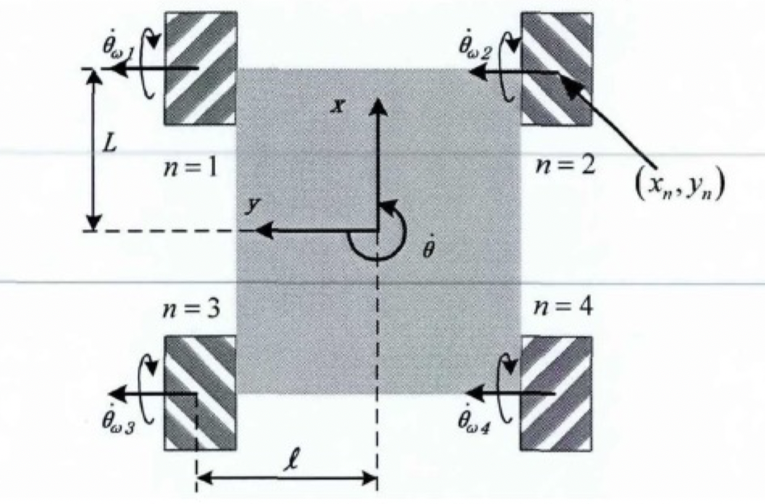

Introduction to PID
===================

$$
PID\=P+I+D
$$

Meaning of PID Controller
-------------------------

PID controller (proportional-integral-derivative controller) consists of proportional unit, integral unit, and derivative unit. The characteristics of the controller can be adjusted by adjusting the gains of these three units. The PID controller calculates the error based on the input data and reference value and adjusts the new input value based on historical data to make the system reach or maintain the reference value.

PID can be reduced to PI, PD, P, and I controllers by reducing the control parameters.

Figure 1. Block diagram of the control loop of a PID controller

Theory
------

The PID algorithm can be expressed as follows:

$$
u(t)=K_pe(t)+K_i\int_0^te(\tau)d\tau+K_d\frac{d}{dt}e(t)
$$

Where:

$K$: Proportional gain (tuning parameter)

$e$: Error = Setpoint - Feedback

$t$: Current time

$\tau$: Integration variable

The transfer function in the transfer equation $Y(s)=H(s)X(s)$ is:

$$
H(s)=\frac{K_ds^2+K_ps+K_i}{s+C}
$$

Component Analysis
------------------

### Proportional Unit (P)

Proportional control considers the current error, which is multiplied by the error value and a positive constant $K\_p$ (representing proportionality).

For example, for controlling a kettle, it can be represented as:

$$
P_{out}=K_Pe(t)
$$

where $e(t)$ is the difference between the current temperature and the target temperature (positive), and the control effect curve is shown below:

### Integral Unit (I)

The integral unit considers the total historical error.

It is used to eliminate the bias that exists from the beginning of the system to the present. The integral control term is as follows:

$$
I_{out}=K_i\int_0^te(\tau)d\tau
$$

### Derivative Unit (D)

The derivative unit considers future possible errors.

For example, when controlling a particle to maintain its position at $x=0$, once $\\dot{x}$ is not zero, although there is no error at this time, it means that an error will occur soon, and the derivative unit will react immediately to achieve control.

The differential control term is as follows:

$$
D_{out}=K_d\frac{d}{dt}e(t)
$$

Parameter Tuning
----------------

### Two Types of Systems

1.  Linear system

For general linear systems, the gain value generally does not change, and multiple simulation simulations are usually required in the design until the final control result achieves satisfactory results.

2.  Nonlinear system

For nonlinear systems, an algorithm may be needed to control the variable parameters (gain planning algorithm correction).

### Tuning Methods

It can be divided into four types:

1.  Manual tuning
2.  Ziegler-Nichols method
3.  Software debugging
4.  Cohen-Coon

