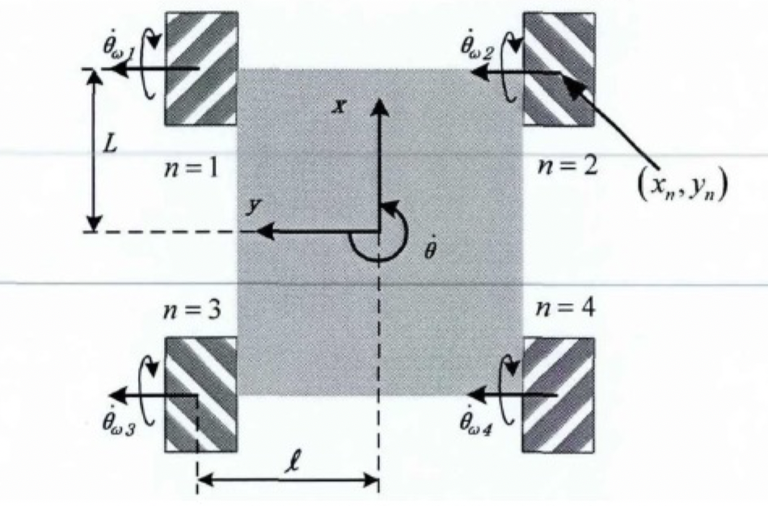

# Mecanum轮

## 已有的研究

- 国内的研究机构（东南大学、上海大学、哈尔滨工业大学、浙江大学）
- 王一治分析并建立了Mecanum四轮系统的运动学模型
- A.Gfrerrer推导了考虑棍子形状时精确的运动学模型
- G.Campion等利用矩阵变换推导了三维运动方程
- Patrick F.Muir等建立了考虑车轮打滑的运动学模型
- K.Nagatan等给出一种考虑车轮打滑问题等可视化位姿计算算法
- L.Gracia等利用对机器人动力学逐次近似的方法推导考虑车轮打滑的运动学模型

## Mecanum四轮系统的运动学正逆解算法

<aside>
💡 基于理想条件

</aside>

车辆的运动可以由如下三个量来表达: 

$$
（\dot{x},\dot{y},\omega)
$$

我们可以控制四个电机的转速: 

$$
（\omega_1,\omega_2,\omega_3,\omega_4)
$$

从而实现对运动的控制

这两个矢量用矩阵$B$进行换算

$$
\begin{bmatrix}
\omega_1\\
\omega_2\\
\omega_3\\
\omega_4\\
\end{bmatrix}
=B\cdot
\begin{bmatrix}
\dot{x}\\
\dot{y}\\
\omega\\
\end{bmatrix}
$$

上图为本项目Mecanum轮的排列方式示意图

得益于G.Campion等的工作, 我们可以直接给出逆矩阵$B$;

$$
B=\frac{1}{R}
\begin{bmatrix}
1&-1&-L-l\\
1&1&L+l\\
1&1&-L-l\\
1&-1&L+l\\
\end{bmatrix}
$$

## Mecanum轮的动力学建模

定义：$m$是车辆的总质量，$J_z,J_r$分别为车辆绕$z$轴的转动惯量和轮子的转动惯量

下面使用拉格朗日法进行动力学建模：

势能：

$$
V=0
$$

动能：

$$
⁍
$$

由拉格朗日方程：

$$
\frac{d}{dt}(\frac{\partial K}{\partial \omega_i})-\frac{\partial K}{\partial \theta_i}=T_i
$$

入$K;(\dot{x},\dot{y},w)$解出：

$$
\bm{T}=\bm{M\cdot\ddot{\theta}}+\bm{D\cdot\dot{\theta}}
$$

其中：

$$
T=(T_1,T_2,T_3,T_4)^T\\\theta=(\theta_1,\theta_2,\theta_3,\theta_4)^T\\D=diag(D_1,D_2,D_3,D_4)
$$

T为电机的输出力矩，D为与摩擦有关的系数矩阵，式中：

$$
 M=\begin{bmatrix}
C&-B&B&D\\-B&C&B&D\\B&D&C&-B\\D&B&-B&C 
\end{bmatrix}\\A=\frac{mR^2}{8}\\B=\frac{J_zR^2}{16(L+l)^2}\\C=A+B+J_r\\D=A-B
$$

在后续的算法设计中，应该考虑力矩$T$的影响
