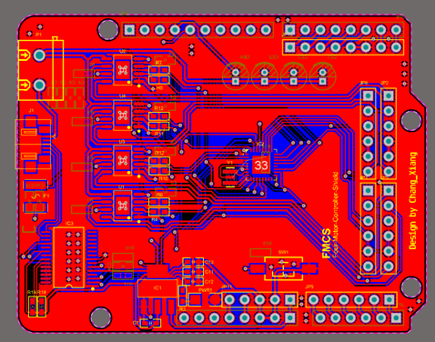

# OmniRob

OmniRob是一个基于麦卡纳姆轮的全向移动小车

采用模块化设计，车身支持4个扩展模块，在本项目中安装了两个模块：4路红外传感器、物料投放模块

介绍
--

本项目起源于我在大一上学期参加的课程：设计与建造

课程要求我们设计一款既能循迹又能投放物料的小车。与传统循迹小车类似，该车辆将沿着白色场地中的黑色轨迹运行。不同之处在于，我们还需要为其配备一个物料储存和投放装置，使车辆在轨迹的交叉点处精准投放物体。

所以便有了OmniRob这个开源项目，他是一个开源的、低成本的、组装简单的、模块化设计的麦卡纳姆轮小车。使用4个编码器直流有刷电机驱动，控制器使用Arduino，为了驱动电机，我还使用为Arduino设计了一块电机驱动Shield板，后面会提到。

车辆上端和前后一共有4个模块化接口，可以安装不同的模块，我们的前端安装了一个4路红外传感器，上端安装了一个由舵机驱动的物料储存与投放装置。

材料表
--

1. 3D打印的底壳，上盖板，投放机构
2. 4个MG513直流减速电机，减速比1：30
3. 4个直径65mm的麦卡纳姆轮
4. 若干M2.5螺丝
5. MG996R舵机
6. Arduino UNO
7. 自制的4电机驱动Shield（直接插在Uno上）
8. 12V锂电池
9. 4路红外传感器

**总成本 ~40$**

安装与内部结构见[安装指南](https://github.com/CassiusXiang/OmniRob/blob/main/Installation.md)

## 驱动 Shield - MUNO

驱动Shield使用2层PCB设计，使用Altium Designer 2022设计

驱动板使用了4颗AS4950进行电机的驱动，驱动电流最大可达到单路2A

## 投放装置

## 视频演示

https://www.youtube.com/watch?v=084VByHCzTs

安装和使用
--

见[安装指南](https://github.com/CassiusXiang/OmniRob/blob/main/Installation.md)

许可证
---

OmniRob采用MIT许可证进行发布。请参考[LICENSE](https://github.com/CassiusXiang/OmniRob/blob/main/LICENSE)获取更多信息。

联系方式
----

如果您有任何问题或反馈，请通过[Issues](https://github.com/CassiusXiang/OmniRob/issues)与我们联系。

我的邮箱: changxiangchina@outlook.com
