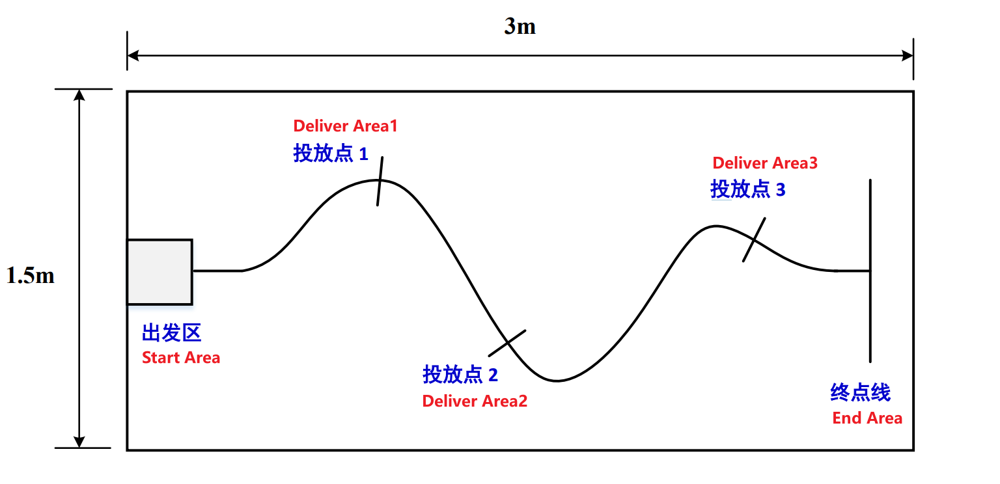
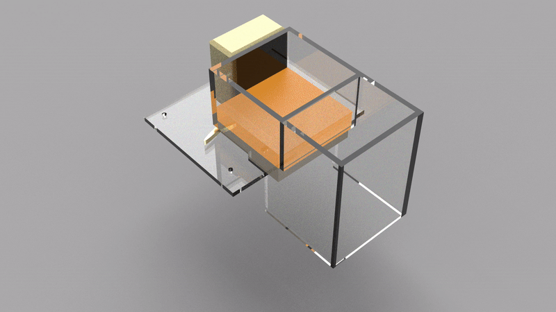

# OmniRob

OmniRob is an omnidirectional mobile robot based on Mecanum wheels.

Featuring a modular design, the chassis supports four expansion modules. In this project, two modules are installed: a 4-way infrared sensor module and a material dispensing module.

## Introduction

This project originated from a course I took in the first semester of my freshman year: Design and Construction.

The course required us to design a vehicle that could both follow a track and dispense materials. Similar to traditional line-following cars, this vehicle runs along black lines on a white surface. The difference is that we also needed to equip it with a material storage and dispensing device, allowing the vehicle to accurately dispense objects at intersections on the track.

Thus, the OmniRob open-source project was born. It is an open-source, low-cost, easy-to-assemble, modularly designed Mecanum wheel robot. It uses four DC brushed motors with encoders, controlled by an Arduino. To drive the motors, I also designed a motor driver Shield board for the Arduino, which will be discussed later.

The top and front/back of the vehicle have four modular interfaces for installing different modules. We installed a 4-way infrared sensor at the front and a material storage and dispensing device driven by a servo motor at the top.

## Components

1. 3D-printed chassis, top cover, dispensing mechanism
2. 4 MG513 DC gear motors, gear ratio 1:30
3. 4 Mecanum wheels with a diameter of 65mm
4. Several M2.5 screws
5. MG996R servo motor
6. Arduino UNO
7. Custom 4-motor driver Shield (directly plugs into the Uno)
8. 12V lithium battery
9. 4-way infrared sensors

**Total Cost ~\$40**

For installation and internal structure, see the [Installation Guide](https://github.com/CassiusXiang/OmniRob/blob/main/Installation.md).

## Motor Driver Shield - MUNO

The motor driver Shield uses a 2-layer PCB design, created with Altium Designer 2022.

The driver board uses four AS4950 chips to drive the motors, with a maximum driving current of up to 2A per channel.

## Dispensing Mechanism

## Video Demonstration

[Watch the Video](https://www.youtube.com/watch?v=084VByHCzTs)

## Installation and Usage

Refer to the [Installation Guide](https://github.com/CassiusXiang/OmniRob/blob/main/Installation.md).

## License

OmniRob is released under the MIT License. Please refer to the [LICENSE](https://github.com/CassiusXiang/OmniRob/blob/main/LICENSE) file for more information.

## Contact

If you have any questions or feedback, please contact us through [Issues](https://github.com/CassiusXiang/OmniRob/issues).

My email: changxiangchina@outlook.com